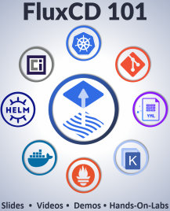

In this lab we'll learn how to install **Flux CLI** and **Flux Server Components** within a Kubernetes Cluster.

> Udemy Course - [FluxCD 101](https://www.udemy.com/course/gitops-flux)

> Coupon Code - **GITOPS-FLUX-APR-2023**

###### ****If you face any issue or have a new suggestion, please raise it here: [issues tracker](https://github.com/sidd-harth/fluxcd-tracker/issues)*