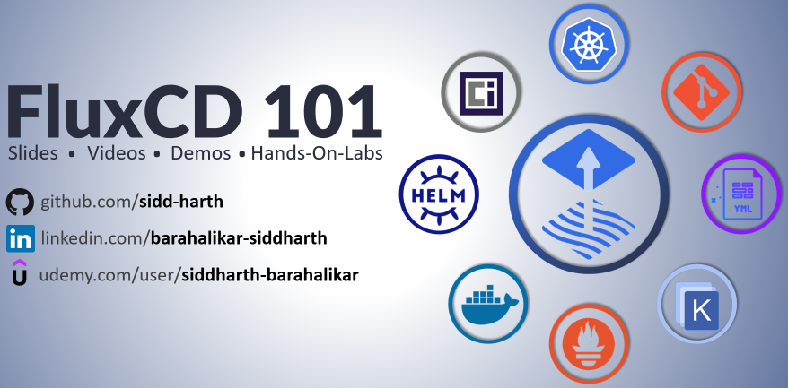

In this lab we'll learn how to encrypt/decrypt secrets using **Bitnami Sealed Secrets**.

> Udemy Course - [FluxCD 101](https://www.udemy.com/course/gitops-flux/?couponCode=GITOPS-FLUX-APR-2023)

> Coupon Code - [**GITOPS-FLUX-APR-2023**](https://www.udemy.com/course/gitops-flux/?couponCode=GITOPS-FLUX-APR-2023)

###### ****If you face any issue or have a new suggestion, please raise it here: [issues tracker](https://github.com/sidd-harth/fluxcd-tracker/issues)*
